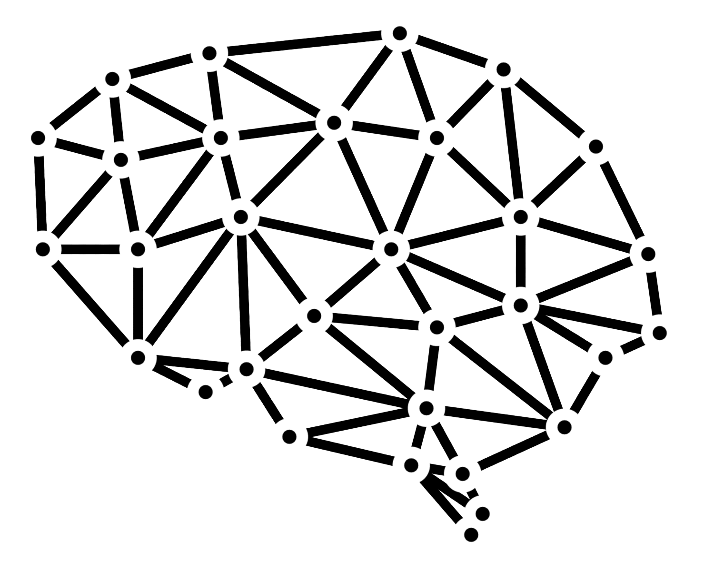
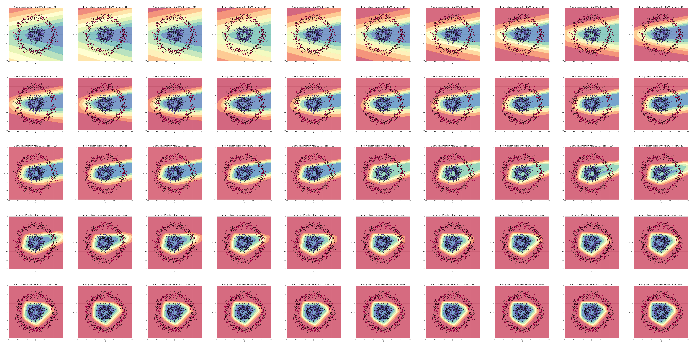
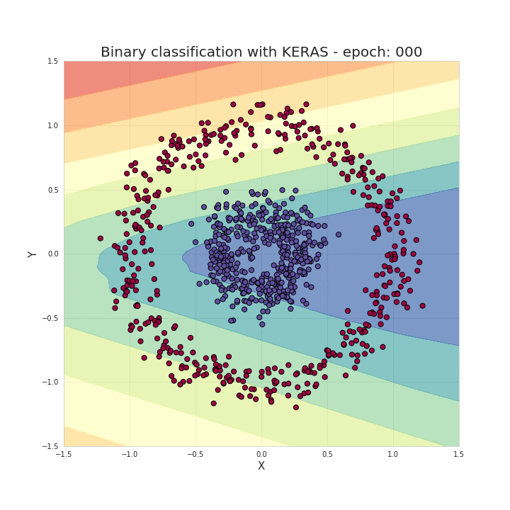
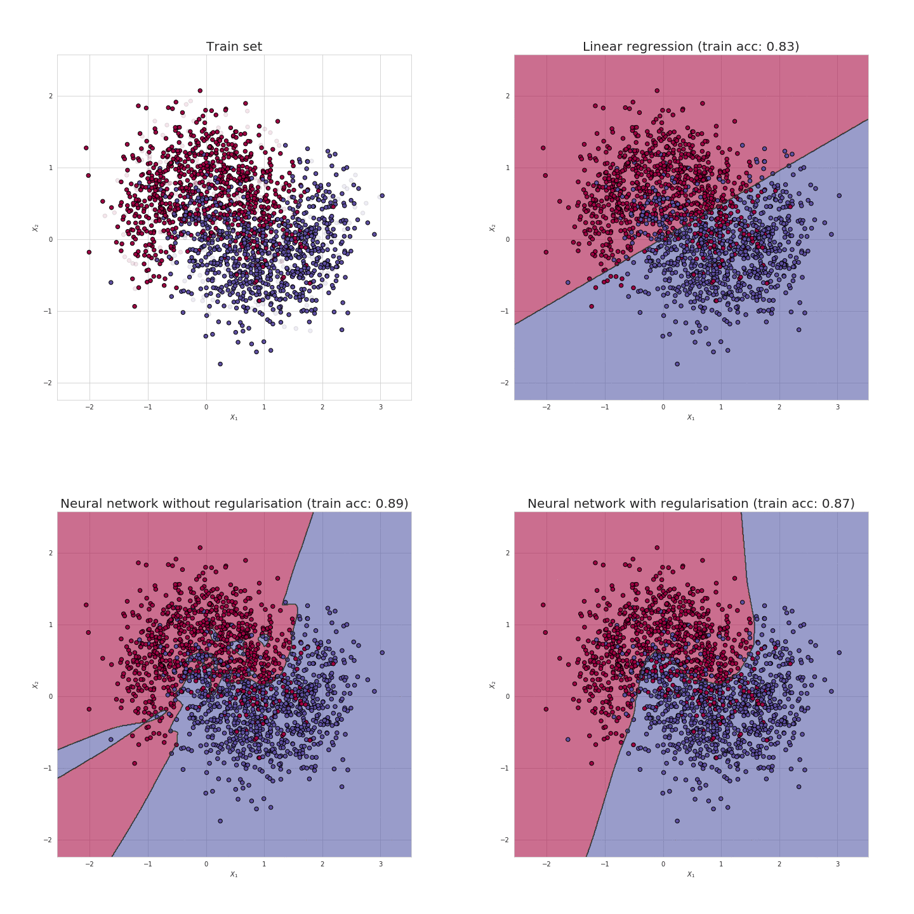

<h1 align="center">neural_networks_book.py</h1>

<p align="center"> 
    
</p>

## Descrição

Este repositório contém pequenos projetos relacionados ao Deep Learning. Os assuntos estão intimamente ligados aos artigos do Piotr Skalski no [Medium][1]. Este material foi adaptado a partir do trabalho original de Piotr Skalski, com o objetivo de demonstrar os processos de redes neurais e as visualizações que ele aplicou. Agradecemos ao autor por compartilhar seu conhecimento e inspiração.

## Começando

```bash
# clonar o repositório
git clone https://github.com/talesnobre/neural_networks_book.py.git

# navegar até o diretório principal
cd neural_networks_book.py

# configurar e ativar o ambiente Python
apt-get install python3-venv
python3 -m venv .env
source .env/bin/activate

# instalar todos os pacotes necessários
pip install -r requirements.txt
```

## Mergulhando na Matemática por Trás das Redes Neurais
[Artigo no Medium][2] - [Código fonte](./nn/01_mathematics_of_nn/)

Este projeto é focado principalmente na visualização de questões bastante complexas relacionadas ao gradiente descendente, funções de ativação e visualização de limites de classificação durante o treinamento do modelo. É um código que complementa os tópicos descritos em mais detalhes no artigo. Aqui estão algumas das visualizações criadas.

<p align="center"> 
    
    
</p>

<p align="center"> 
    <b>Figura 1.</b> Um gráfico de limites de classificação criado em cada iteração do modelo Keras.</br>
    Finalmente, os frames foram combinados para criar uma animação. 
</p>

<p align="center"> 
    
</p>

<p align="center"> 
    <b>Figura 2.</b> Visualização do gradiente descendente.
</p>

## Vamos Codar uma Rede Neural Apenas com NumPy
[Artigo no Medium][11] - [Código fonte](./nn/03_numpy_neural_net/)

Após uma introdução teórica, chegou a hora de implementar na prática uma rede neural usando NumPy. Neste notebook, você encontrará o código-fonte completo e uma comparação do desempenho da implementação básica com o modelo criado com Keras. Você pode encontrar um comentário mais amplo para entender a ordem e o significado das funções realizadas em um artigo relacionado.

<p align="center"> 
    
</p>

<p align="center"> 
    <b>Figura 3.</b> Visualização dos limites de classificação alcançados com um modelo simples em NumPy.
</p>

## Prevenindo o Overfitting em Redes Neurais Profundas
[Artigo no Medium][3] - [Código fonte](./nn/02_exploring_overfitting/)

Desta vez, o foco está na análise das razões para o overfitting e nas formas de preveni-lo. Foram feitas simulações de regulação de redes neurais para diferentes coeficientes lambda, analisando a mudança de valores na matriz de pesos. Veja algumas das visualizações criadas no processo.

<p align="center"> 
    
</p>

<p align="center"> 
    <b>Figura 4.</b> Limites de classificação criados por: canto superior direito - regressão linear;</br>
    canto inferior esquerdo - rede neural; canto inferior direito - rede neural com regularização.
</p>

<p align="center"> 
    
</p>

<p align="center"> 
    <b>Figura 5.</b> Mudança dos valores de acurácia em épocas subsequentes durante o aprendizado da rede neural.
</p>

## Como Treinar Redes Neurais Mais Rápido com Otimizadores?
[Artigo no Medium][16] - [Código fonte](./nn/04_optimizers/)

Rede neural usando apenas o NumPy. Foi uma tarefa muito desafiadora, mas ao mesmo tempo ampliou significativamente minha compreensão dos processos que ocorrem dentro da rede neural. Entre outras coisas, essa experiência me fez perceber verdadeiramente quantos fatores influenciam o desempenho de uma rede neural. Arquitetura selecionada, valores adequados de hiperparâmetros ou até mesmo a iniciação correta dos parâmetros são apenas alguns desses fatores... Desta vez, no entanto, focaremos na decisão que tem um enorme impacto na velocidade do processo de aprendizado, bem como na precisão das previsões obtidas - a escolha da estratégia de otimização.

<p align="center"> 
    
</p>

<p align="center"> 
    <b>Figura 6.</b> Exemplos de pontos que são um problema para algoritmos de otimização.
</p>

<p align="center"> 
    
</p>

<p align="center"> 
    <b>Figura 7.</b> Comparação de otimizadores.
</p>

## Método Simples para Criar Gráficos Animados
[Artigo no Medium][4] - [Código fonte](./02_data_science_toolkit/01_animated_graphs/)

Tanto em meus artigos quanto em meus projetos, procuro criar visualizações interessantes, que frequentemente permitem comunicar minhas ideias de forma muito mais eficaz. Decidi criar um breve tutorial para mostrar como criar facilmente visualizações animadas usando Matplotlib. Também recomendo a leitura do meu post onde descrevo, entre outras coisas, como criar uma visualização do processo de aprendizado de uma rede neural.

<p align="center"> 
    
</p>

<p align="center"> 
    <b>Figura 8.</b> Atrator de Lorenz criado usando a API de animação do Matplotlib.
</p>

## Licença

Este projeto está licenciado sob a Licença MIT - veja o arquivo [LICENSE.md][6] para mais detalhes.

## Materiais e Ideias Interessantes

Este é um lugar onde coleto links para artigos e trabalhos interessantes, que espero que se tornem a base para meus próximos projetos no futuro.

1. [Man is to Computer Programmer as Woman is to Homemaker? Debiasing Word Embeddings][5]
2. [Sequence to Sequence Learning with Neural Networks][7]
3. [Learning Phrase Representations using RNN Encoder-Decoder for Statistical Machine Translation][8]
4. [BLEU: a Method for Automatic Evaluation of Machine Translation][9]
5. [Neural Machine Translation by Jointly Learning to Align and Translate][10]
6. [A (Long) Peek into Reinforcement Learning][12]
7. [Why Momentum Really Works][13]
8. [Improving the way neural networks learn][14]
9. [Classification and Loss Evaluation - Softmax and Cross Entropy Loss][15]

[1]: https://medium.com/@piotr.skalski92
[2]: https://towardsdatascience.com/https-medium-com-piotr-skalski92-deep-dive-into-deep-networks-math-17660bc376ba
[3]: https://towardsdatascience.com/preventing-deep-neural-network-from-overfitting-953458db800a
[4]: https://towardsdatascience.com/simple-method-of-creating-animated-graphs-127c11f58cc5
[5]: https://arxiv.org/abs/1607.06520
[6]: ./LICENSE.md
[7]: https://arxiv.org/abs/1409.3215
[8]: https://arxiv.org/abs/1406.1078
[9]: https://www.aclweb.org/anthology/P02-1040.pdf
[10]: https://arxiv.org/abs/1409.0473
[11]: https://towardsdatascience.com/lets-code-a-neural-network-in-plain-numpy-ae7e74410795
[12]: https://lilianweng.github.io/lil-log/2018/02/19/a-long-peek-into-reinforcement-learning.html#sarsa-on-policy-td-control
[13]: https://distill.pub/2017/momentum/
[14]: http://neuralnetworksanddeeplearning.com/chap3.html
[15]: https://deepnotes.io/softmax-crossentropy
[16]: https://towardsdatascience.com/how-to-train-neural-network-faster-with-optimizers-d297730b3713
